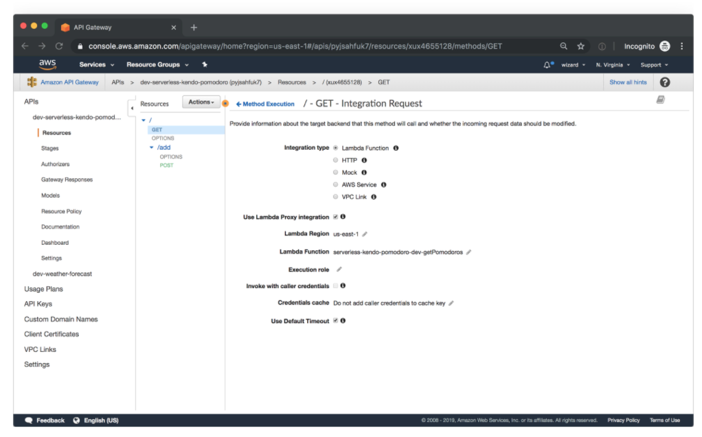

# AWS: API, Dynamo and Lambda

**What is Amazon API Gateway?**

Amazon API Gateway is a managed service that allows developers to define the HTTP endpoints of a REST API or a WebSocket API and connect those endpoints with the corresponding backend business logic. It also handles authentication, access control, monitoring, and tracing of API requests.

**Why is Amazon API Gateway an important part of the Serverless ecosystem?**

Within the Serverless ecosystem, API Gateway is the piece that ties together Serverless functions and API definitions.

**How does API Gateway integrate with other AWS services?**

Many AWS services support integration with Amazon API Gateway, including:

AWS Lambda: run Lambda functions to generate HTTP API responses.

AWS SNS: publish SNS notifications when an HTTP API endpoint is accessed.

Amazon Cognito: provide authentication and authorization for your HTTP APIs

