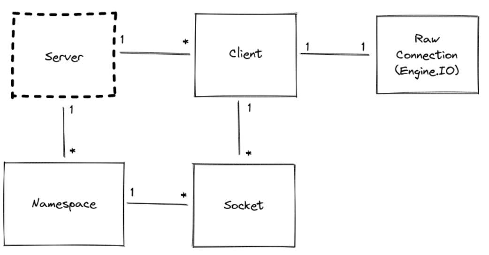

# Integrating Socket.IO
Socket.IO is composed of two parts:

1-A server that integrates with (or mounts on) the Node.JS HTTP Server socket.io

2-A client library that loads on the browser side socket.io-client

# Rooms

A room is an arbitrary channel that sockets can join and leave. It can be used to broadcast events to a subset of clients:

## Joining and leaving

io.on("connection", (socket) => {

  socket.join("some room");
});

io.to("some room").emit("some event");

## Room events

create-room (argument: room)

delete-room (argument: room)

join-room (argument: room, id)

leave-room (argument: room, id)

# Namespaces

A Namespace is a communication channel that allows you to split the logic of your application over a single shared connection (also called "multiplexing").

# Client initialization

const socket = io(); // or io("/"), the main namespace

const orderSocket = io("/orders"); // the "orders" namespace

const userSocket = io("/users"); // the "users" namespace

