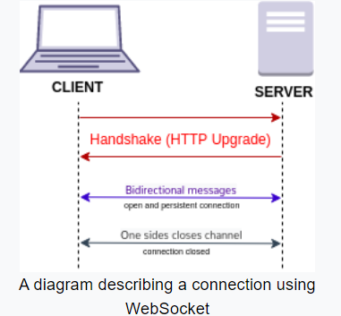

# Socket
WebSocket is a computer communications protocol, providing full-duplex communication channels over a single TCP(Transmission Control Protocol) connection. 

# Socket.IO
Socket.IO is a JavaScript library for real-time web applications.

npm install --save express socket.io

create socket.io

var app = require('express')();

var http = require('http').Server(app);

var io = require('socket.io')(http);

**Default Namespaces**

The root namespace '/' is the default namespace

**Custom Namespaces**

var nsp = io.of('/my-namespace');

