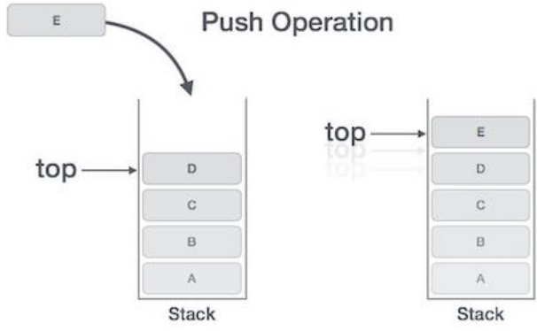
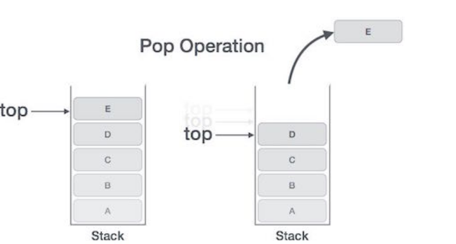
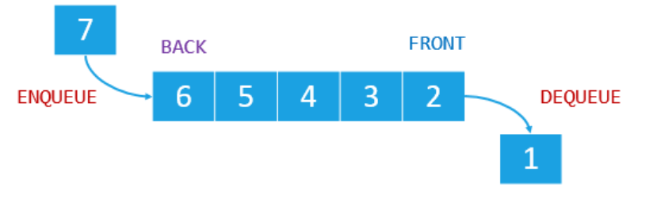

# Stack

A stack is a data structure that consists of Nodes. Each Node references the next Node in the stack, but does not reference its previous.

**Common terminology for a stack is**

Push - Nodes or items that are put into the stack are pushed

Pop - Nodes or items that are removed from the stack are popped. When you attempt to pop an empty stack an exception will be raised.

Top - This is the top of the stack.
Peek - When you peek you will view the value of the top Node in the stack. When you attempt to peek an empty stack an exception will be raised.

IsEmpty - returns true when stack is empty otherwise returns false.

**Push O(1)**

**ALOGORITHM** push(value)

// INPUT <-- value to add, wrapped in Node internally

// OUTPUT <-- none

   node = new Node(value)

   node.next <-- Top

   top <-- Node

   **Pop O(1)**

   

   **ALGORITHM** pop()
// INPUT <-- No input

// OUTPUT <-- value of top Node in stack

// EXCEPTION if stack is empty

   Node temp <-- top

   top <-- top.next

   temp.next <-- null

   return temp.value

   **Peek O(1)**

   ALGORITHM peek()

// INPUT <-- none

// OUTPUT <-- value of top Node in stack

// EXCEPTION if stack is empty

   return top.value

   # What is a Queue

   Common terminology for a queue is

Enqueue - Nodes or items that are added to the queue.

Dequeue - Nodes or items that are removed from the queue. If called when the queue is empty an exception will be raised.

Front - This is the front/first Node of the queue.

Rear - This is the rear/last Node of the queue.

Peek - When you peek you will view the value of the front Node in the queue. If called when the queue is empty an exception will be raised.

IsEmpty - returns true when queue is empty otherwise returns false.

