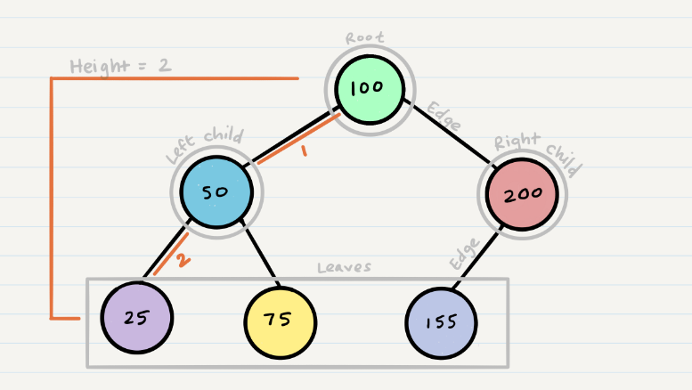

# Common Terminology

Node - A Tree node is a component which may contain its own values, and references to other nodes

Root - The root is the node at the beginning of the tree

K - A number that specifies the maximum number of children any node may have in a k-ary tree. In a binary tree, k = 2.

Left - A reference to one child node, in a binary tree

Right - A reference to the other child node, in a binary tree

Edge - The edge in a tree is the link between a parent and child node

Leaf - A leaf is a node that does not have any children

Height - The height of a tree is the number of edges from the root to the furthest leaf

## Depth First

Pre-order: root >> left >> right

In-order: left >> root >> right

Post-order: left >> right >> root

Pre-order
ALGORITHM preOrder(root)
// INPUT <-- root node
// OUTPUT <-- pre-order output of tree node's values

    OUTPUT <-- root.value

    if root.left is not Null
        preOrder(root.left)

    if root.right is not NULL
        preOrder(root.right)
**In-order**

    ALGORITHM inOrder(root)
    // INPUT <-- root node
     // OUTPUT <-- in-order output of tree node's values

    if root.left is not NULL
        inOrder(root.left)

    OUTPUT <-- root.value

    if root.right is not NULL
        inOrder(root.right)
**Post-order**

           ALGORITHM postOrder(root)
     // INPUT <-- root node
     / / OUTPUT <-- post-order output of tree node's values

    if root.left is not NULL
        postOrder(root.left)

    if root.right is not NULL
        postOrder(root.right)

    OUTPUT <-- root.value
